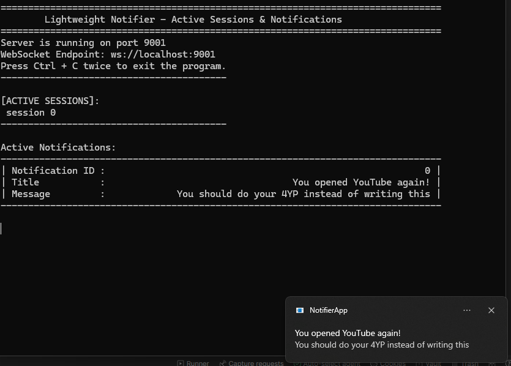

# **Lightweight Notifier**

### ⚡ A minimal and efficient notification system for Windows 11+.

🚧 *Still under development!* This project is functional on Windows 11+, and I am currently testing cross-platform compatibility while improving support for multiple clients. If you are interested in using it, feel free to try it out or raise any issues—I'll do my best to address them! 🚀

---

## **Introduction**

Lightweight Notifier is a simple and compact (310KB) tool designed to bridge client scripts with the Windows Toast Notifications API. It allows you to send and manage notifications through a WebSocket endpoint.

💡 **Use Cases**

- Get instant alerts for **concert ticket availability** 🎟️
- Be notified when **stock prices drop** 📉
- Stay focused and get reminders when **you open YouTube while working** 🚀
- Connect any script to trigger notifications based on real-time events.

You can write client scripts based on your interests, send an update to the notifier, and a toast notification will pop up on your screen.



---

## **How to Use**

### **Building the Project**

You can directly use the pre-built `notifier.exe` file.

However, if you want to **customize functionality**, you can build the project using CMake:

### **Prerequisites**

- Ensure you have **CMake** installed with **Ninja generator support**.
- Make sure your environment supports **C++20**.
- Install dependencies using **vcpkg**:
  ```sh
  vcpkg install libuv unofficial-uwebsockets nlohmann-json
  ```
- You will need **uv.dll** to be placed in the same folder as `notifier.exe`, which is readily available online or in your **vcpkg** folder. Please refer to the release note for details.

### **Development Version**

1. Open the **Developer Command Prompt for Visual Studio (x64)**:
   - Open the Start Menu, search for "x64 Native Tools Command Prompt for VS", and launch it.
2. Set up the build using the development preset:
   ```sh
   cmake --preset dev
   ```
3. Build the project:
   ```sh
   cmake --build build/dev --config Debug
   ```
4. Run the executable:
   - Navigate to the `build/dev` folder and run `notifier.exe`.

### **Production Version**

1. Open the **Developer Command Prompt for Visual Studio (x64)**:
   - Open the Start Menu, search for "x64 Native Tools Command Prompt for VS", and launch it.
2. Set up the build using the production preset:
   ```sh
   cmake --preset prod
   ```
3. Build the project:
   ```sh
   cmake --build build/prod --config Release
   ```
4. Run the executable:
   - Navigate to the `build/prod` folder and run `notifier.exe`.

---

## **Creating a Connection**

To establish a connection, use a **WebSocket client** to connect to the server:

```javascript
ws://localhost:9001
```

---

## **Sending Notifications**

Once connected, you can send notifications to the notifier. The server expects notifications in the following format:

```json
{
    "sessionID": "0",
    "action": "create",
    "payload": {
        "title": "You opened YouTube again!",
        "message": "You should do your 4YP instead of writing this."
    }
}
```

📜 For a complete list of supported formats and commands, check the [`assets/how-to.md`](assets/how-to.md) file.

---

## **Common Questions**

The Windows Toast Notification requires a start-menu shortcut. This is the reason why there is a `shortcut_util` class. This is a necessary step due to how Windows handles toast notifications. More details can be found in the official documentation:
[Windows Toast Notification Documentation](https://learn.microsoft.com/en-us/previous-versions/windows/apps/hh779727(v=win.10))

## **License**

This project is licensed under the **MIT License**.

---


